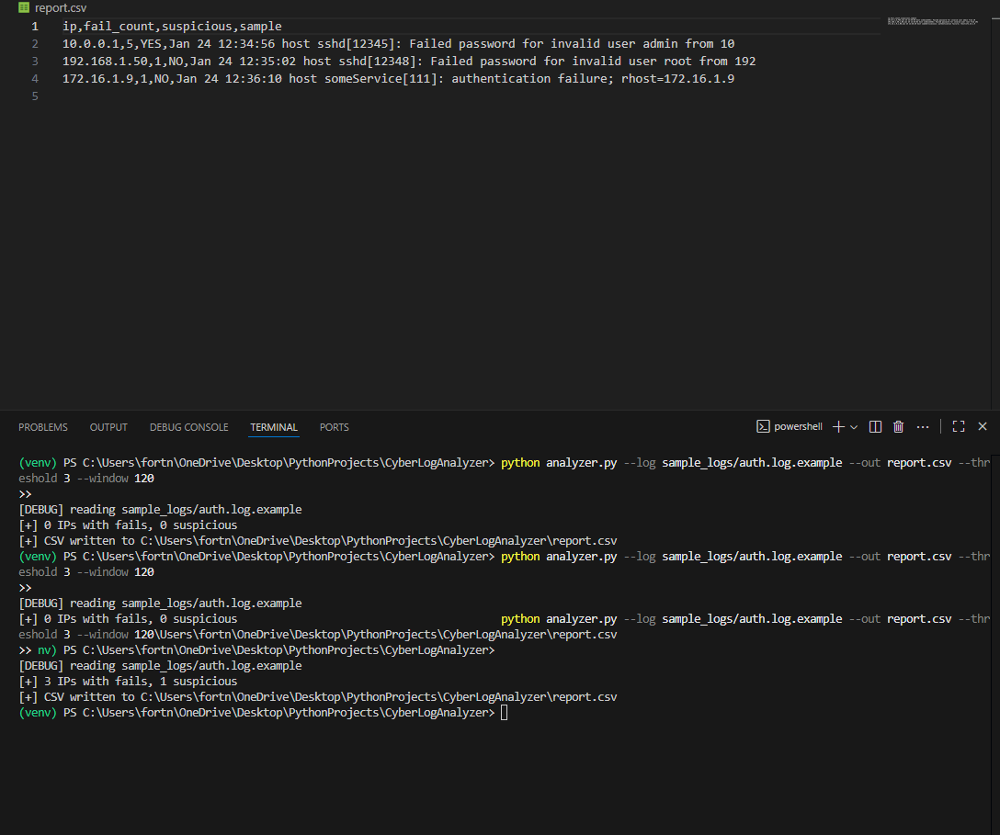

# 🛡️ CyberLogAnalyzer
Parses authentication logs and flags suspicious IPs showing repeated failed logins in a short window.

## Run

python analyzer.py --log sample_logs/auth.log.example --out report.csv --threshold 3 --window 120

## 🖼️ Demo Screenshot

> Example output showing suspicious IPs flagged from repeated failed logins.
